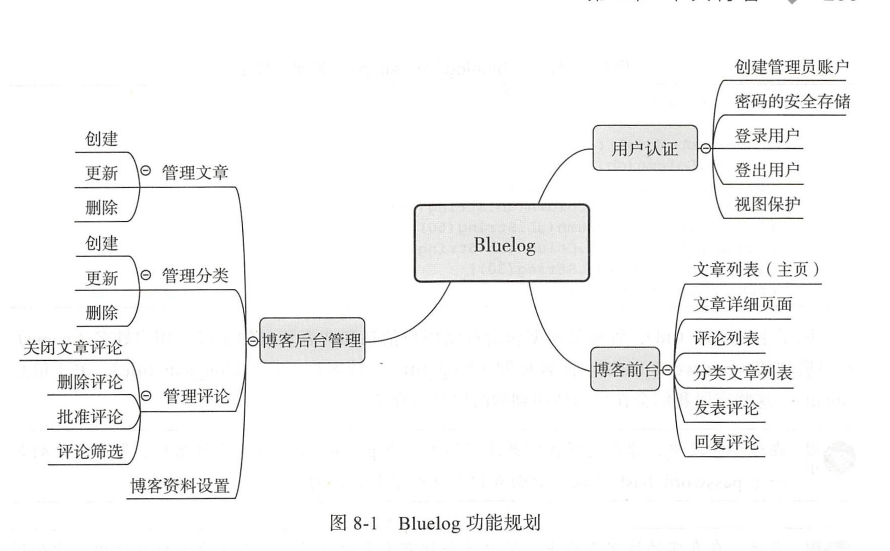

# 目录
   * [个人博客](#个人博客)
      * [功能设计](#功能设计)
      * [数据库](#数据库)
         * [1 管理员](#1-管理员)
         * [2 分类](#2-分类)
         * [3 文章](#3-文章)
         * [4 评论](#4-评论)
         * [5 回复](#5-回复)
      * [模板](#模板)
         * [前台](#前台)
         * [后台](#后台)
         * [其他模板下载地址](#其他模板下载地址)
         * [模板上下文](#模板上下文)
      * [表单](#表单)
      * [视图函数](#视图函数)
      * [电子邮件支持](#电子邮件支持)
   * [博客前台](#博客前台)
      * [分页显示文章列表](#分页显示文章列表)
   * [初始化博客](#初始化博客)
      * [安全存储密码](#安全存储密码)
   * [使用Flask-login管理用户认证](#使用flask-login管理用户认证)
     * [获取当前用户](#获取当前用户)
     * [登入用户](#登入用户)
     * [登出用户](#登出用户)
     * [视图保护](#视图保护)
   * [使用CSRFProtect 实现CSRF 保护](#使用csrfprotect-实现csrf-保护)
   * [编写博客后台](#编写博客后台)
   * [开发学习](#开发学习)
      * [一 扩展](#一-扩展)
         * [Flask-Login](#flask-login)
         * [Unidecode](#unidecode)
      * [二 蓝本](#二-蓝本)
         * [1. 视图函数 route()装饰器注册](#1-视图函数-route装饰器注册)
         * [2. 错误处理函数](#2-错误处理函数)
         * [3. 请求处理函数](#3-请求处理函数)
         * [4. 模板上下文处理函数](#4-模板上下文处理函数)
         * [5. 蓝本资源](#5-蓝本资源)
      * [三 app](#三-app)
         * [flask run](#flask-run)
         * [current_app](#current_app)

---

# 个人博客
博客是CMS（Content Management System ，内容管理系统）
- 博客前台：展示用户的博客内容
- 博客后台：仅开放给博客管理员，对博客资源进行添加，修改和删除等操作。

## 功能设计
 

## 数据库
一共4张表，分别是存储管理员(Admin),分类(Category),文章(Post),评论(Comment)
### 1 管理员
个人博客的话，大部分固定信息可以写死在模板中,或是使用自定义的配置存储在配置文件中。
但是我们希望编写的是一个通用的博客平台，我们要把这些信息的设置交给最终的用户

管理员：提供博客信息修改功能，这些信息不能仅仅定义在配置文件中，而要存储到数据库。
用户可以方便地在程序界面修改设置，而不用手动编辑配置文件

### 2 分类
存储文章的类型，且名称不允许重复

### 3 文章
分类与文章需要建立 一对多关系

### 4 评论
评论与文章建立 一对多关系

### 5 回复
重用评论这个class，评论与回复是一对多关系

## 模板
### 前台


### 后台


### 其他模板下载地址
[Bootswatch](https://bootswatch.com/)

[StartBootstrap](https://startbootstrap.com/)

### 模板上下文
在基模板的导航栏以及博客主页需要使用博客的标题，副标题等存储在管理员对象上的数据，为了
避免每个视图函数中渲染模板时传入直接数据，我们在模板上下文处理函数中向模板上下文
添加了管理员对象变量（admin）。在多个页面包含的边栏中包含分类列表，把分类数据传入到模板
上下文中。

## 表单
- 登录表单
- 文章表单
- 分类表单
- 评论表单
- 博客设置表单

## 视图函数
- blog ： 博客主页

## 电子邮件支持
文章有了新评论后发送邮件通知管理员。而且，当管理员回复了读者的评论后，也需要发送邮件提醒读者

这里使用了 Flask-Mail 发送邮件，需要创建.env文件写入环境变量以便发信功能正常

两个场景
- 当文章有新评论时，发送邮件给管理员
- 当某个评论被回复时，发送邮件给被回复用户。


# 博客前台
前台包括所有用户，包括显示文章列表，博客信息，文章内容和评论等功能
- 分页显示文章列表
- 显示文章正文
- 文章固定链接
- 显示分类文章列表
- 显示评论列表
- 发表评论与回复
- 支持回复评论
- 网站主题切换

## 分页显示文章列表
先在渲染主页模板的index视图中的数据库获取所有文章记录并传入模板，然后在主页模板中
使用for语句迭代所有文章记录，依次渲染文章标题，发表时间和正文

# 初始化博客
实现认证系统前，我们首先要解决的问题是如何创建用户。在多用户程序中，我们需要提供一个完整的注册
流程。但在简单的单人博客中，我们提供了一个初始化命令，管理员账户即通过这个命令创建。

## 安全存储密码
创建管理员用户存储密码不能明文的形式存储在数据库
- 不存储密码本身，而是存储通过密码生成的散列值（hash）。每个密码对应着独一无二的散列值
- 需要加盐（随机字符，增加散列值随机性）计算散列值，提高随机性，防止攻击者通过彩虹表攻击逆向破解密码
- 还需要使用HMAC重复计算很多次（5000次）获得派生密钥，增大攻击者暴力破解密码的难度

过去复杂，交给第三方库，常用的计算密码散列值的Python库有PassLib，bcrybt等。

Flask主要依赖Werkzeug也提供了security模块中提供了`generate_passwd_hash()`,`check_password_hash()`


# 使用Flask-login管理用户认证
我们需要添加用户认证功能。登录用户视作管理员，而未登录用户被视为匿名用户。使用Flask-login可以轻松
处理用户登录与登出等操作。

Flask-login表示用户的类必须实现表所示的这几个属性和方法，以便来判断用户的认证状态。


初始化与使用：
- 通过对用户对象调用各种方法和属性即可判断用户的状态。让用户类继承Flask-Login提供的UserMixin类，
  它包含了这些方法和属性的默认实现
    ```python
    from flask_login import UserMixin
    from flask_sqlalchemy import SQLAlchemy
    db = SQLAlchemy()
    
    # UserMinxin 表示通过认证的用户，所以is_authenticated 和 is_active回返回True，is_anonymous则返回False。
    # get_id() 默认会查找用户对象的id属性值作为id
    class Admin(db.Model,UserMixin):
        pass
    ```

登录与登出：
- 视图函数中调用 `login_user()` 或 `logout_user()` ，传入登入/登出的用户类对象。
- 登录:使用Flask的session对象将用户的id值存储于浏览器的cookie中。
- 登出：Flask的session对象存储于客户端的session cookie会被删除，所以用户会登出
- 保持有效：login_user()将remember设置为True，创建一个remember_token的cookie，当关闭浏览器导致user_id cookie失效，它会重新恢复user_id cookie的值
    - 默认过期时间为365天，REMEMBER_COOKIE_DURATION进行设置，设为datetime.timedelta对象即可。
- 注意事项：防止破坏Flask-Login提供的认证功能，在视图函数中操作session时要避免使用**user_id** 和 remember_token 作为Key

### 获取当前用户
为了返回当前用户对应的用户模型类对象。需要做一个 【 id <-> 用户对象 】 的映射


调用`current_user`时，Flask-Login 会调用用户加载函数并返回对应的用户对象。如果用户已经登录，返回Admin类实例。
如果用户未登录，current_user默认会返回Flask-Login内置的`AnonymousUserMixin`类对象，它的is_authenticated和is_active属性返回False, is_anonymous属性返回True

`current_user`存储于请求上下文堆栈上，current_user需要激活请求上下文程序才可以使用

### 登入用户
首先页脚写入跳转到表单的HTML


[代码](./project/blueprints/auth.py)  `login_user()`

### 登出用户
[代码](./project/blueprints/auth.py)  `logout_user()`

### 视图保护
这有认证的用户才能登录进该页面，使用login_required装饰器实现
- 所有的管理页面都需要login_required的保护
- 为admin蓝本注册一个before_request处理函数，然后为这个函数附加login_required装饰器
，因为使用before_request钩子注册的函数会为每一个请求前运行，所以这样就可以为该蓝本下所有的视图函数添加保护，函数内容可以为空

    
    - 但是为了避免在书中单独给出视图函数代码时造成误解，Bluelog程序并没有使用这个技巧

# 使用CSRFProtect 实现CSRF 保护
后台涉及对资源的局部更新和删除操作，我们要考虑到CSRF保护问题。
- 为了应对CSRF攻击，需要创建，修改和删除数据，需要将这类请求通过POST方法提交，同时提交请求的表单中添加CSRF令牌
- CSRFProtect是Flask-WTF内置的扩展，也是Flask-WTF内部使用的CSRF组件，单独使用可以实现对程序的全局CSRF保护。
- 提供了生成和验证CSRF令牌的函数，方便再不使用WTForms表单类的情况下实现CSRF保护
- **CSRFProtect 在模板中提供了一个csrf_token()函数**
    
- 默认下，令牌验证出错或过期，程序返回400错误，和Werkzeug内置的其他HTTP异常类一样，CSRFError将错误描述保存在
  异常对象的description属性中
    

# 编写博客后台
一般管理员面板通常会使用独立样式的界面，


# 开发学习
## 一 扩展
### Flask-Login
实现用户认证，区分请求的来源客户端的身份，根据不同的身份返回不同的响应

### Unidecode


## 二 蓝本
### 1. 视图函数 route()装饰器注册


### 2. 错误处理函数
- 使用蓝本实例的errorhandler()装饰器把错误处理器注册到蓝本上，这些错误处理器只会捕捉
访问该蓝本中的路由发生的错误；
- 使用蓝本实例的app_errorhandler()装饰器可以注册一个全局的错误处理器

### 3. 请求处理函数
- 在蓝本中，使用before_request,after_request,teardown_request等装饰器注册的请求
处理函数是蓝本独有的，也就是说，只有该蓝本中的视图函数对应的请求才会触发相应的请求
处理函数。
- before_app_request,after_app_request,teardown_app_request,before_app_first_request方法，
这些方法注册的请求处理函数是全局的

### 4. 模板上下文处理函数
- 蓝本实例可以使用context_processor装饰器注册蓝本特有的模板上下文处理器；
- 使用app_context_processor装饰器则会注册程序全局的模板上下文处理器

### 5. 蓝本资源


## 三 app
### flask run
```shell script
flask run
```
Flask的自动发现程序实例机制还包含另一种行为：Flask 会自动从环境变量FLASK_APP的值定义的模块中寻找名为create_app()或make_app()的工厂函数
自动从环境变量FLASK_APP的值定义的模块中寻找名为create_app()或make_app()的工厂函数
自动调用工厂函数创建程序实例并运行。

.flaskenv文件中将FLASK_APP设定为bluelog，所以不需要更改任何设置

### current_app
表示当前程序实例的代理对象。某个程序实例被创建并运行时，它会自动指向当前运行的程序实例，并把所有操作转发到当前程序实例

current_app.config
(current_app是程序上下文全局变量，只有激活了程序上下文之后才能使用)

